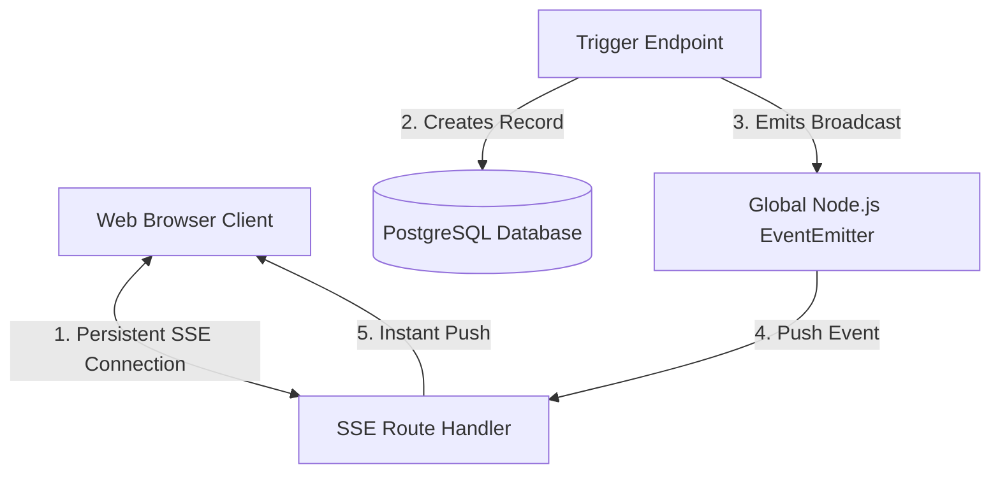

# 🏗️ هيكل النظام (Architecture)

يعتمد مشروع **Cafe Services** على معمارية حديثة ومصممة خصيصاً للسرعة والموثوقية، مع التركيز على الاتصال اللحظي المباشر.

## 1. التقنيات الأساسية (Tech Stack)

- **الإطار (Framework):** Next.js 16 (App Router).
- **قاعدة البيانات:** PostgreSQL مدارة بواسطة Prisma ORM.
- **التصميم (Styling):** Tailwind CSS v4 مع دعم كامل للـ Glassmorphism و Dark Mode.
- **الحالة (State Management):** React Context API لتمرير البيانات اللحظية للمكونات.
- **الإشعارات (Real-Time):** Server-Sent Events (SSE).

---

## 2. محرك الإشعارات اللحظية (Real-Time Engine)

بدلًا من استخدام مكتبات خارجية ثقيلة (مثل Socket.io أو Pusher)، تم بناء محرك داخلي باستخدام **Server-Sent Events (SSE)** المدمج في متصفحات الويب:

### كيف يعمل؟

1. **الاشتراك (Subscription):**
   يقوم المتصفح (Client) بفتح اتصال عبر مسار `/api/notifications/stream`.
2. **الاستماع (Event Emitter):**
   الخادم (Server) يعتمد على `EventEmitter` خاص بـ Node.js (`src/lib/emitter.ts`).
3. **الإرسال (Broadcasting):**
   عند قيام عميل بإنشاء طلب أو استدعاء النادل (`/api/notifications/create`)، يتم حفظ الإشعار في قاعدة البيانات، ويقوم الـ Emitter بإرسال الحدث إلى جميع المتصفحات المتصلة فوراً.
4. **منع الإغلاق (Ping):**
   يرسل الخادم نبضة (`: ping`) كل 20 ثانية لمنع الـ Proxies (مثل Nginx) من إغلاق الاتصال.

---

## 3. التنبيه الصوتي الذكي (Web Audio API)

للتخلص من ملفات الـ MP3 و WAV وتقليل حجم التطبيق، يتم توليد صوت الإشعارات "برمجياً" داخل المتصفح:

- عند استلام إشعار، يقوم `window.AudioContext` بتوليد نغمة متناغمة (Chord Harmonies).
- تمتاز هذه التقنية بالسرعة الفائقة وعدم حاجتها للتحميل المسبق.
